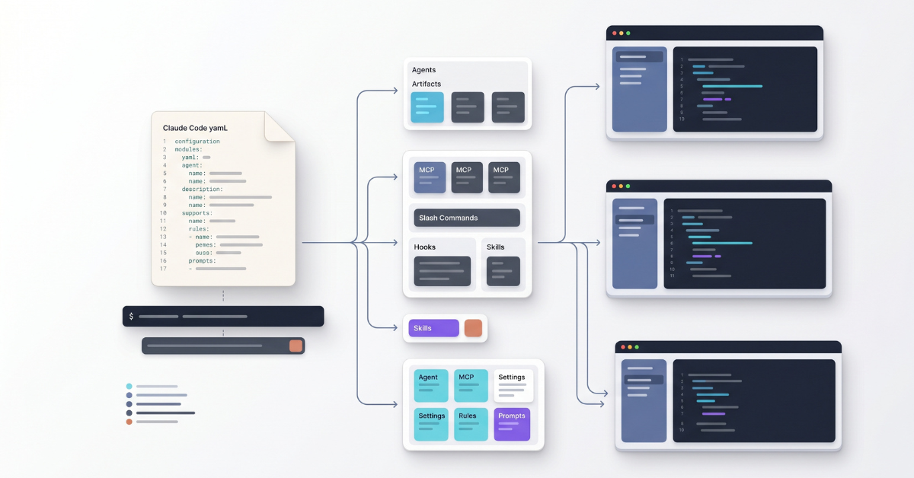

# Claude Code Toolbox

<p align="center">
  
</p>

[](https://github.com/alex-feel/claude-code-toolbox/blob/main/LICENSE) [](https://deepwiki.com/alex-feel/claude-code-toolbox)

Automated installers and an environment configuration framework for Claude Code on Windows, macOS, and Linux.

Define your complete Claude Code environment in a single YAML file -- custom agents, MCP servers, slash commands, hooks, skills, model settings, and more -- and install everything with one command.

## Features

- **Custom agents** -- specialized subagents for code review, research, debugging, and any workflow you design
- **MCP servers** -- HTTP, SSE, and stdio transports with automatic permission pre-allowing
- **Slash commands** -- custom commands for frequently used workflows
- **Rules** -- user-scope rule files for coding standards, security policies, and project conventions
- **Skills** -- multi-file skill packages for complex agent capabilities
- **System prompts** -- replace or append to the default Claude Code prompt
- **Hooks** -- four hook types: command (shell scripts), HTTP (webhooks), prompt (LLM evaluation), and agent (subagent with tools)
- **Permissions** -- fine-grained allow, deny, and ask rules for Claude Code tools and actions
- **Model and reasoning control** -- model selection, effort levels (low, medium, high, max), thinking mode
- **User and global settings** -- direct control over `settings.json` and `~/.claude.json`
- **Status line** -- custom status bar scripts for real-time session information
- **Configuration inheritance** -- extend and override parent configurations with selective per-key merge
- **Dependency management** -- platform-specific package installation (apt, brew, choco, and more)
- **File downloads** -- arbitrary files downloaded to specified destinations during setup
- **Private repository support** -- GitHub and GitLab authentication with token-based access
- **Cross-platform** -- consistent behavior across Windows, macOS, and Linux
- **One-command setup** -- everything from a single YAML configuration file

## Quick Start

### Example Configuration

```yaml
name: "My Development Environment"

command-names:
  - "my-env"

# Base URL for downloading agents, commands, hooks, and other files
base-url: "https://raw.githubusercontent.com/my-org/my-configs/main"

agents:
  - "agents/code-reviewer.md"

slash-commands:
  - "commands/review.md"

rules:
  - "rules/coding-standards.md"

mcp-servers:
  - name: "context-server"
    transport: "http"
    url: "http://localhost:8000/mcp"

model: "sonnet"
effort-level: "high"

command-defaults:
  system-prompt: "prompts/system-prompt.md"
  mode: "append"

hooks:
  files:
    - "hooks/linter.py"
  events:
    - event: "PostToolUse"
      matcher: "Edit|MultiEdit|Write"
      type: "command"
      command: "linter.py"
```

This creates a global `my-env` command that launches Claude Code with your custom agents, MCP servers, and hooks. See the [Environment Configuration Guide](docs/environment-configuration-guide.md) for all configuration keys.

### Install Your Environment

Host your YAML configuration in a repository, then run a single command to set everything up:

**Linux:**

```bash
export CLAUDE_CODE_TOOLBOX_ENV_CONFIG='https://raw.githubusercontent.com/your-org/your-repo/main/config.yaml' && curl -fsSL https://raw.githubusercontent.com/alex-feel/claude-code-toolbox/main/scripts/linux/setup-environment.sh | bash
```

**macOS:**

```bash
export CLAUDE_CODE_TOOLBOX_ENV_CONFIG='https://raw.githubusercontent.com/your-org/your-repo/main/config.yaml' && curl -fsSL https://raw.githubusercontent.com/alex-feel/claude-code-toolbox/main/scripts/macos/setup-environment.sh | bash
```

**Windows:**

```powershell
powershell -NoProfile -ExecutionPolicy Bypass -Command "`$env:CLAUDE_CODE_TOOLBOX_ENV_CONFIG='https://raw.githubusercontent.com/your-org/your-repo/main/config.yaml'; iex (irm 'https://raw.githubusercontent.com/alex-feel/claude-code-toolbox/main/scripts/windows/setup-environment.ps1')"
```

You can also use a local file (`./my-config.yaml`) or a configuration from a private repository. See the [Environment Configuration Guide](docs/environment-configuration-guide.md) for all options including authentication.

### Ready-Made Configurations

Browse the [claude-code-artifacts-public](https://github.com/alex-feel/claude-code-artifacts-public) repository for ready-made environment configurations. Find a configuration you like, copy its raw URL, and use it as the `CLAUDE_CODE_TOOLBOX_ENV_CONFIG` value in the commands above.

See [Ready-Made Configurations](docs/environment-configuration-guide.md#ready-made-configurations) for installation examples.

## Installing Claude Code

If you just need the Claude Code CLI without a custom environment configuration, the toolbox includes standalone installers that use the official Anthropic native installer with automatic npm fallback.

See the [Installing Claude Code](docs/installing-claude-code.md) guide for platform-specific commands and options.

## Documentation

- [Environment Configuration Guide](docs/environment-configuration-guide.md) -- complete reference for YAML configuration files with all keys, authentication, inheritance, and more
- [Installing Claude Code](docs/installing-claude-code.md) -- standalone Claude Code installation, methods, and troubleshooting

## Security

Environment configurations can execute commands on your system, download files, and configure MCP servers. Only use configurations from sources you trust.

Local files are under your control. Remote URLs should be verified before use. The setup script displays a confirmation prompt and flags sensitive paths before proceeding.

See the [Security Considerations](docs/environment-configuration-guide.md#security-considerations) section for details.

## Contributing

Contributions are welcome! Please see [CONTRIBUTING.md](CONTRIBUTING.md) for guidelines.

## License

MIT License -- see [LICENSE](LICENSE) for details.

## Disclaimer

This is a community project and is not officially affiliated with Anthropic. Claude Code is a product of Anthropic, PBC.

## Getting Help

- **Bug reports**: [Report a bug](https://github.com/alex-feel/claude-code-toolbox/issues/new?template=bug-report.yml)
- **Feature requests**: [Suggest a feature](https://github.com/alex-feel/claude-code-toolbox/issues/new?template=feature-request.yml)
- **Documentation issues**: [Report a docs issue](https://github.com/alex-feel/claude-code-toolbox/issues/new?template=docs-issue.yml)
- **Questions**: [Ask a question](https://github.com/alex-feel/claude-code-toolbox/issues/new?template=question.yml)
