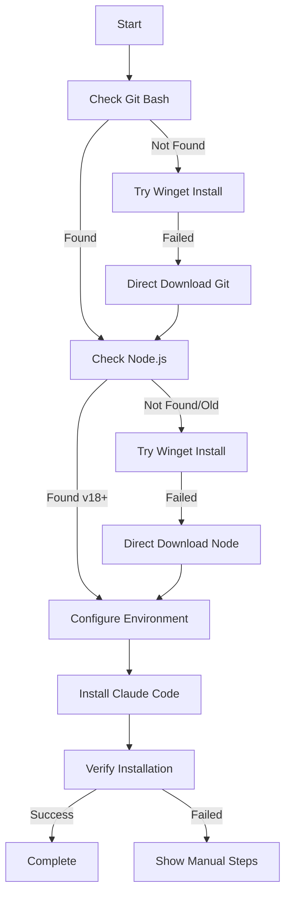

# Windows Installer Internals

Technical documentation for the PowerShell installation script.

## Architecture Overview

The installer follows a resilient, multi-fallback approach:

```text
1. Check for dependency
2. Try preferred installation method (winget)
3. Fall back to direct download if needed
4. Verify installation
5. Configure environment
```

## Key Components

### 1. Dependency Management

#### Winget Dependencies
Winget (App Installer) requires Microsoft.UI.Xaml.2.8 framework. The installer:
1. Detects missing winget
2. Installs UI.Xaml framework first
3. Then installs App Installer
4. Falls back to direct downloads if this fails

```powershell
function Install-UIXamlFramework {
    # Downloads and installs Microsoft.UI.Xaml.2.8.x64.appx
    # Required for App Installer/winget to work
}
```

### 2. Caching Strategy

To prevent redundant installation attempts:

```powershell
# Script-level cache variables
$script:WingetAvailable = $null
$script:WingetCheckAttempted = $false
```

This ensures winget installation is only attempted once per script run, even if multiple components need it.

### 3. PATH Management

The installer uses a comprehensive PATH refresh strategy:

```powershell
function Refresh-Path {
    # Combines Machine and User PATH
    # Adds npm global path if missing
    # Ensures new installations are immediately available
}
```

### 4. Installation Methods

Each component has multiple installation methods:

#### Git Installation
1. **Primary**: winget (if available)
2. **Fallback**: Direct download from git-scm.com

#### Node.js Installation
1. **Primary**: winget (if available)
2. **Fallback**: Direct download from nodejs.org (latest LTS)

#### Claude Code Installation
- Always uses official installer from claude.ai

### 5. Verification Strategy

The installer tries multiple methods to find the claude command:

```powershell
# Search locations in order:
1. Standard PATH (Get-Command claude)
2. NPM global directory (%APPDATA%\npm\claude.cmd)
3. NPM prefix location (npm config get prefix)
```

## Error Handling

### Graceful Degradation
- If winget fails → use direct downloads
- If verification fails → provide manual instructions
- If elevation needed → auto-elevate with user consent

### Common Failure Scenarios

1. **Missing UI.Xaml Framework**
   - Error: 0x80073CF3
   - Solution: Install framework before App Installer

2. **PATH Not Updated**
   - Cause: Environment variables not refreshed
   - Solution: Comprehensive PATH refresh or new terminal

3. **Corporate Proxy**
   - Issue: Downloads blocked
   - Solution: Respect HTTP_PROXY/HTTPS_PROXY variables

## Installation Flow



## Performance Optimizations

1. **Lazy Evaluation**: Winget only installed if needed
2. **Caching**: Installation attempts cached to prevent retries
3. **Silent Installs**: All installations run silently for speed
4. **Progress Suppression**: `$ProgressPreference = 'SilentlyContinue'`

## Security Considerations

1. **HTTPS Only**: All downloads use HTTPS
2. **Official Sources**: Downloads from official repositories only
3. **Signature Validation**: Windows validates .msixbundle signatures
4. **Elevation**: Only elevates when necessary, with user prompt

## Testing

### Manual Testing
```powershell
# Test on clean system
powershell -NoProfile -ExecutionPolicy Bypass -File install-claude-windows.ps1

# Test with existing partial installations
# Test with corporate proxy
# Test without admin rights
```

### Automated Testing Scenarios
1. Fresh Windows installation
2. Existing Git but no Node.js
3. Old Node.js version
4. No winget available
5. Behind corporate proxy

## Contributing

When modifying the installer:

1. **Maintain Fallbacks**: Always provide alternative installation methods
2. **Cache Checks**: Use script-level caching for expensive operations
3. **User Feedback**: Provide clear status messages
4. **Error Details**: Include actionable error messages
5. **Test Thoroughly**: Test on various Windows configurations

## Common Issues and Solutions

### Issue: Redundant Winget Attempts
**Cause**: Multiple functions calling `Ensure-Winget`
**Solution**: Implemented script-level caching

### Issue: UI.Xaml Missing
**Cause**: App Installer requires UI.Xaml framework
**Solution**: Install framework before App Installer

### Issue: PATH Not Refreshed
**Cause**: Environment variables not reloaded
**Solution**: Comprehensive `Refresh-Path` function

### Issue: Claude Not Found After Install
**Cause**: NPM global path not in PATH
**Solution**: Check multiple locations and add npm path

## Future Improvements

1. **Parallel Downloads**: Download Git and Node.js simultaneously
2. **Version Management**: Allow specific version installations
3. **Offline Mode**: Support air-gapped installations
4. **Chocolatey Integration**: Add as alternative package manager
5. **Diagnostic Mode**: Enhanced logging for troubleshooting
