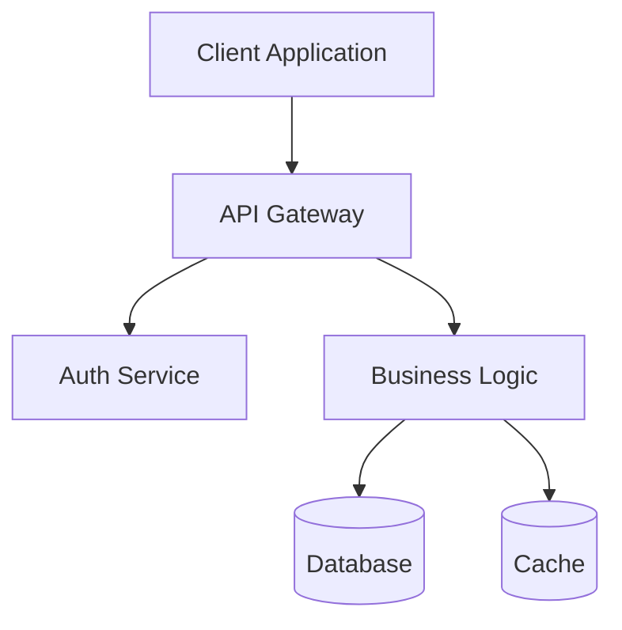

# Technical Documentation Framework

Ultrathink about the documentation needs, audience, and best practices. Create clear, comprehensive, and maintainable documentation.

## Documentation Target

**Subject**: $ARGUMENTS

Analyze arguments to determine:
- Documentation type (API, README, Architecture, User Guide)
- Target audience (developers, users, stakeholders)
- Technical level (beginner, intermediate, advanced)
- Format requirements (Markdown, JSDoc, OpenAPI)

## Documentation Standards

### 1. README Template

```markdown
# Project Name

[](link)
[](link)
[](link)
[](link)

> Brief, compelling project description

## 🚀 Features

- Key feature 1
- Key feature 2
- Key feature 3

## 📦 Installation

### Prerequisites
- Requirement 1 (version)
- Requirement 2 (version)

### Quick Start
```bash
# Installation command
npm install package-name

# Basic usage
package-name --help
```

## 📚 Usage

### Basic Example
```javascript
const package = require('package-name');

// Simple usage example
package.doSomething({
  option1: 'value',
  option2: true
});
```

### Advanced Usage
[More complex examples]

## 🔧 Configuration

| Option | Type | Default | Description |
|--------|------|---------|-------------|
| option1 | string | 'default' | What it does |
| option2 | boolean | false | When to use |

## 🎯 API Reference

### `functionName(params)`

Brief description

**Parameters:**
- `param1` (Type): Description
- `param2` (Type, optional): Description

**Returns:** Type - Description

**Example:**
```javascript
const result = functionName('value', { option: true });
```

## 🧑‍💻 Development

### Setup
```bash
git clone https://github.com/user/repo
cd repo
npm install
npm run dev
```

### Testing
```bash
npm test          # Run tests
npm run coverage  # Generate coverage report
```

## 🤝 Contributing

See [CONTRIBUTING.md](CONTRIBUTING.md)

## 📄 License

[License Type](LICENSE)

## 🙏 Acknowledgments

- Credit 1
- Credit 2
```markdown

### 2. API Documentation

### JSDoc Example
```javascript
/**
 * Process user data with validation and transformation
 * @async
 * @function processUserData
 * @param {Object} userData - The user data to process
 * @param {string} userData.name - User's full name
 * @param {string} userData.email - User's email address
 * @param {number} [userData.age] - User's age (optional)
 * @param {Object} [options={}] - Processing options
 * @param {boolean} [options.validate=true] - Whether to validate input
 * @param {boolean} [options.transform=false] - Whether to transform data
 * @returns {Promise<ProcessedUser>} The processed user object
 * @throws {ValidationError} If validation fails
 * @throws {ProcessingError} If processing fails
 * @example
 * const processed = await processUserData(
 *   { name: 'John Doe', email: 'john@example.com' },
 *   { validate: true, transform: true }
 * );
 * @since 1.0.0
 * @see {@link https://docs.example.com/api#processUserData}
 */
```

### OpenAPI/Swagger
```yaml
operationId: createUser
summary: Create a new user
description: Creates a new user with the provided information
tags:
  - Users
requestBody:
  required: true
  content:
    application/json:
      schema:
        $ref: '#/components/schemas/UserInput'
      example:
        name: John Doe
        email: john@example.com
responses:
  '201':
    description: User created successfully
    content:
      application/json:
        schema:
          $ref: '#/components/schemas/User'
  '400':
    description: Invalid input
  '409':
    description: User already exists
```

### 3. Architecture Documentation

```markdown
# System Architecture

## Overview
[High-level system description]

## Architecture Diagram


## Components

### API Gateway
- **Purpose**: Request routing, rate limiting
- **Technology**: Node.js, Express
- **Endpoints**: [List key endpoints]

### Business Logic Layer
- **Purpose**: Core application logic
- **Patterns**: Service layer, Repository pattern
- **Key Services**: [List services]

## Data Flow
1. Client sends request
2. API Gateway validates and routes
3. Business logic processes
4. Data persisted/retrieved
5. Response returned

## Technology Stack
- **Frontend**: React, TypeScript
- **Backend**: Node.js, Express
- **Database**: PostgreSQL
- **Cache**: Redis
- **Queue**: RabbitMQ

## Deployment
- **Environment**: AWS/GCP/Azure
- **Orchestration**: Kubernetes
- **CI/CD**: GitHub Actions
```markdown

### 4. User Guide Template

```markdown
# User Guide

## Getting Started

### First-Time Setup
1. [Step-by-step instructions with screenshots]
2. [Configuration walkthrough]
3. [Initial setup validation]

### Basic Operations

#### Task 1: [Common Task]
1. Navigate to [location]
2. Click [button/menu]
3. Enter [information]
4. Confirm [action]

> 💡 **Tip**: [Helpful hint]

> ⚠️ **Warning**: [Important caution]

### Advanced Features

#### Feature Name
[Detailed explanation with examples]

### Troubleshooting

#### Problem: [Common Issue]
**Symptoms**: [What users see]
**Cause**: [Why it happens]
**Solution**: [How to fix]

### FAQ

**Q: Common question?**
A: Clear, helpful answer.
```

## Documentation Best Practices

### Writing Guidelines
- **Clear and Concise**: Avoid jargon, explain acronyms
- **Consistent Style**: Use same terminology throughout
- **Visual Aids**: Include diagrams, screenshots, examples
- **Progressive Disclosure**: Basic → Advanced
- **Scannable**: Use headers, bullets, tables

### Code Examples
- **Runnable**: Examples should work as-is
- **Relevant**: Show real use cases
- **Commented**: Explain non-obvious parts
- **Complete**: Include imports, setup

### Maintenance
- **Version**: Document which version applies
- **Changelog**: Track documentation updates
- **Links**: Check for broken links regularly
- **Feedback**: Provide way to report issues

## Documentation Checklist

- [ ] Purpose clearly stated
- [ ] Target audience identified
- [ ] Prerequisites listed
- [ ] Installation steps complete
- [ ] Usage examples provided
- [ ] API fully documented
- [ ] Configuration explained
- [ ] Troubleshooting included
- [ ] Contributing guidelines
- [ ] License information
- [ ] Contact/support info
- [ ] Search-friendly keywords
- [ ] Mobile-responsive formatting
- [ ] Accessibility considered
- [ ] Reviewed for accuracy

Now generating comprehensive documentation for the specified target...
